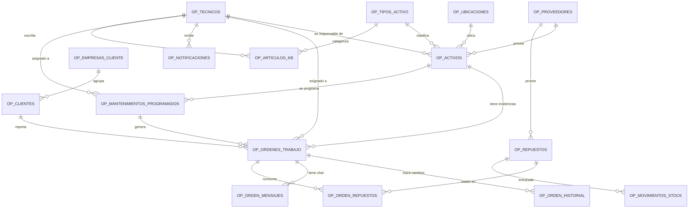

# Modelo de Datos

## Diagrama entidad-relación (simplificado)



## Las 17 tablas

### Catálogos base
| Tabla | Para qué sirve |
|---|---|
| `OP_UBICACIONES` | Dónde están físicamente los activos (edificio/planta/sala) |
| `OP_TIPOS_ACTIVO` | Catálogo de tipos: Servidor, PC, Switch, Impresora... |
| `OP_PROVEEDORES` | Empresas que venden equipos y repuestos |
| `OP_TECNICOS` | Empleados internos. Incluye `ROL` (ADMIN/TECNICO) y vínculo al usuario de login (`USUARIO_APEX`) |

### Inventario
| Tabla | Para qué sirve |
|---|---|
| `OP_ACTIVOS` | El inventario IT en sí: cada equipo, con su tipo, ubicación, técnico responsable |

### Clientes y portal externo
| Tabla | Para qué sirve |
|---|---|
| `OP_EMPRESAS_CLIENTE` | Empresas/comercios externos asociados |
| `OP_CLIENTES` | Usuarios individuales, vinculados a una empresa, con rol `CLIENTE` o `CLIENTE_ADMIN` |

### Órdenes de trabajo / tickets
| Tabla | Para qué sirve |
|---|---|
| `OP_ORDENES_TRABAJO` | El corazón del sistema — cada incidencia/orden, con severidad, prioridad, estado, adjunto |
| `OP_ORDEN_HISTORIAL` | Traza de cada cambio de estado (para medir tiempos de resolución) |
| `OP_ORDEN_MENSAJES` | Hilo de chat entre cliente y técnico sobre un ticket |

### Repuestos y almacén
| Tabla | Para qué sirve |
|---|---|
| `OP_REPUESTOS` | Catálogo de piezas de recambio, con stock actual/mínimo |
| `OP_ORDEN_REPUESTOS` | Qué repuestos se usaron en cada orden (tabla puente) |
| `OP_MOVIMIENTOS_STOCK` | Histórico de entradas/salidas de almacén |

### Sistema
| Tabla | Para qué sirve |
|---|---|
| `OP_AUDITORIA` | Registro genérico de quién cambió qué y cuándo |
| `OP_NOTIFICACIONES` | Avisos internos (stock bajo, orden asignada) |

### Calendario y conocimiento (empleados)
| Tabla | Para qué sirve |
|---|---|
| `OP_MANTENIMIENTOS_PROGRAMADOS` | Reglas de mantenimiento preventivo recurrente (activo + frecuencia). `PKG_MANTENIMIENTOS.generar_ordenes_vencidas` convierte cada una en una `OP_ORDENES_TRABAJO` real cuando llega su fecha, y calcula la siguiente |
| `OP_ARTICULOS_KB` | Base de conocimiento interna: procedimientos y soluciones, con etiquetas simples para búsqueda y contador de vistas |

> `OP_ORDENES_TRABAJO` tiene además la columna `ID_PROGRAMACION` (nullable) para saber si una orden nació manual o de una programación.

### Vistas de KPI (para regiones de Home / paneles)
| Vista | Para qué sirve |
|---|---|
| `VW_KPI_ORDENES_ESTADO` | Conteo de órdenes por estado — gráfico de Home |
| `VW_KPI_ACTIVOS_ESTADO` | Conteo de activos por estado — gráfico de Home |
| `VW_KPI_ORDENES_TECNICO` | Carga de trabajo abierta por técnico — panel del técnico |
| `VW_MANTENIMIENTOS_PROXIMOS` | Programaciones activas ordenadas por próxima fecha — calendario |

Estas vistas se pueden usar en una región `interactiveReport`/`classicReport` exactamente igual que una tabla (`tableName: VW_KPI_ORDENES_ESTADO`), siguiendo el mismo patrón ya establecido en el resto de la app.

## Estados de una Orden de Trabajo / Ticket

```
NUEVO ──► EN_PROCESO ──► RESUELTO ──► CERRADO
                              │
                              └──► REABIERTO (vuelve a EN_PROCESO)

(en cualquier punto) ──► CANCELADO
```

## Los 8 paquetes PL/SQL

| Paquete | Responsabilidad |
|---|---|
| `PKG_AUDITORIA` | Registrar eventos de auditoría (transacción autónoma, no se pierde ni con rollback) |
| `PKG_ORDENES` | Ciclo de vida completo de un ticket: crear, cambiar estado, asignar técnico, añadir/quitar repuestos |
| `PKG_INVENTARIO` | Entradas/salidas de almacén no ligadas a una orden, consulta de repuestos bajo mínimo |
| `PKG_ACTIVOS` | Alta, cambio de estado y baja de un activo (valida que no tenga órdenes abiertas antes de dar de baja) |
| `PKG_REPORTING` | Agregaciones para dashboards (coste por período, tiempo medio de resolución, órdenes críticas abiertas) |
| `PKG_NOTIFICACIONES` | Generar y marcar como leídas las notificaciones internas |
| `PKG_MANTENIMIENTOS` | Programar mantenimientos recurrentes y generar automáticamente las órdenes cuando vencen |
| `PKG_KB` | Crear/actualizar artículos de la base de conocimiento y contar vistas |

## Scripts disponibles (`Base de datos/`)

Migraciones incrementales numeradas — cada una se ejecuta una sola vez, en orden, y ninguna reescribe a las anteriores.

| Script | Contenido |
|---|---|
| `00_RESET_TOTAL.sql` | Borra todo (tablas + paquetes) — solo para reiniciar en desarrollo |
| `01_TABLAS.sql` | Las 17 tablas completas + índices |
| `02_PAQUETES.sql` | 6 de los 8 paquetes PL/SQL |
| `03_TRIGGERS.sql` | Triggers: notificar stock bajo, notificar asignación de técnico |
| `04_ALTA_ADMIN.sql` | Da de alta (o promueve a ADMIN) al usuario logueado actualmente en APEX |
| `04_CALENDARIO_KB.sql` | Calendario de mantenimientos + Base de Conocimiento (`PKG_MANTENIMIENTOS`, `PKG_KB`, y 4 de las 6 vistas `VW_KPI_*`) |
| `05_TECNICOS_BAJA.sql` | Trigger que sella `FECHA_BAJA` automáticamente al desactivar un técnico |
| `06_HOME_KPIS.sql` | Las 2 vistas de KPI que faltaban para Home: `VW_KPI_TECNICOS_ACTIVO`, `VW_KPI_REPUESTOS_BAJO_MINIMO` |
| `07_DATOS_DEMO.sql` | Catálogos, técnicos y equipos de ejemplo |
| `08_FIX_LOGIN_DUPLICADOS.sql` | Corrige el `ORA-01422` al iniciar sesión: dedup + `UNIQUE` constraint en `OP_TECNICOS.USUARIO_APEX` |
| `09_DATOS_DEMO_REPUESTOS.sql` | Datos de ejemplo de repuestos |
| `10_DATOS_DEMO_MOVIMIENTOS.sql` | Datos de ejemplo de movimientos de stock |
| `11_DATOS_DEMO_AUDITORIA.sql` | Datos de ejemplo de auditoría |
| `12_DATOS_DEMO_ORDENES.sql` | 8 Órdenes de Trabajo de ejemplo, cubriendo los 6 estados (`NUEVO`, `EN_PROCESO`, `RESUELTO`, `CERRADO`, `REABIERTO`, `CANCELADO`) — creadas siempre vía `PKG_ORDENES`, nunca INSERT directo |

> `04_ALTA_ADMIN.sql` y `04_CALENDARIO_KB.sql` comparten el mismo prefijo a propósito: son independientes entre sí y ambos se ejecutan después de `03`, en cualquier orden relativo.
